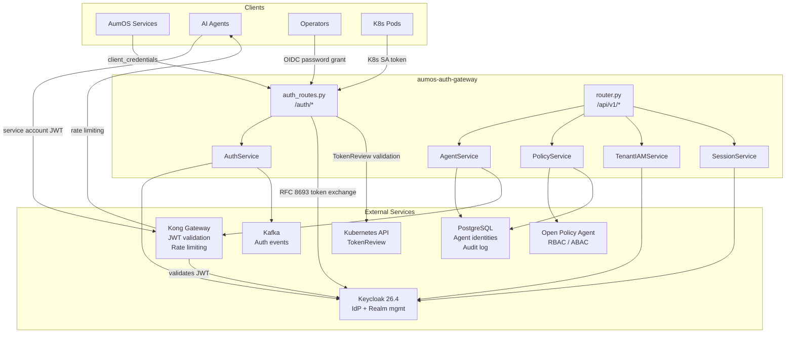

# Architecture

## Component overview

## Data model

### Agent identities (`ath_agent_identities`)

| Column | Type | Description |
|--------|------|-------------|
| id | UUID PK | Agent unique identifier |
| tenant_id | UUID FK | Owning tenant |
| name | text | Human-readable agent name |
| agent_type | text | synthesis / governance / security / orchestrator / analytics |
| privilege_level | int | 1-5 (READ_ONLY through SUPER_ADMIN) |
| allowed_tools | text[] | Allowlisted tool names |
| allowed_models | text[] | Allowlisted model IDs |
| max_tokens_per_hr | int | Token rate limit |
| requires_hitl | bool | Whether HITL approval is required |
| service_account | text | Unique service account name |
| secret_hash | text | bcrypt hash (plaintext never stored) |
| status | text | active / suspended / revoked |
| last_rotated_at | timestamptz | Last secret rotation |
| created_at | timestamptz | Creation time |
| updated_at | timestamptz | Last update time |

### Policy evaluations (`ath_policy_evaluations`)

| Column | Type | Description |
|--------|------|-------------|
| id | UUID PK | Evaluation record ID |
| tenant_id | UUID FK | Owning tenant |
| subject | text | User or agent making the request |
| resource | text | Target resource path or URN |
| action | text | read / write / delete / execute |
| decision | text | allow / deny |
| policy_name | text | OPA policy path used |
| evaluation_ms | float | OPA latency |
| timestamp | timestamptz | Evaluation time |
| context | jsonb | Additional evaluation context |

## Agent privilege system

| Level | Name | HITL Required | Capabilities |
|-------|------|--------------|-------------|
| 1 | READ_ONLY | No | Read data, call read-only tools |
| 2 | STANDARD | No | Standard operations within own tenant |
| 3 | ELEVATED | No | Advanced tools, allowlisted models |
| 4 | PRIVILEGED | Yes (default) | Cross-system operations |
| 5 | SUPER_ADMIN | Yes (always) | Full platform access |

Privilege escalation to level 4+ automatically enables the HITL gate flag at creation time.

## OPA policy routing

| Resource pattern | Policy path |
|-----------------|-------------|
| `urn:agent:*` | `agent/privilege_levels` |
| `urn:hitl:*` | `agent/hitl_gates` |
| `*tenant*` | `rbac/tenant_isolation` |
| `/api/*` | `rbac/roles` |
| (default) | `abac/resource_access` |

OPA failures are **fail-closed** — access is denied if OPA is unreachable.

## Kafka events published

| Event type | Topic | Trigger |
|-----------|-------|---------|
| `auth.login` | AUTH_EVENTS | Successful token issuance |
| `auth.logout` | AUTH_EVENTS | Token revocation |
| `agent.created` | AGENT_LIFECYCLE | New agent identity registered |
| `agent.revoked` | AGENT_LIFECYCLE | Agent identity deleted |
| `policy.evaluated` | POLICY_DECISIONS | Every OPA policy evaluation |
