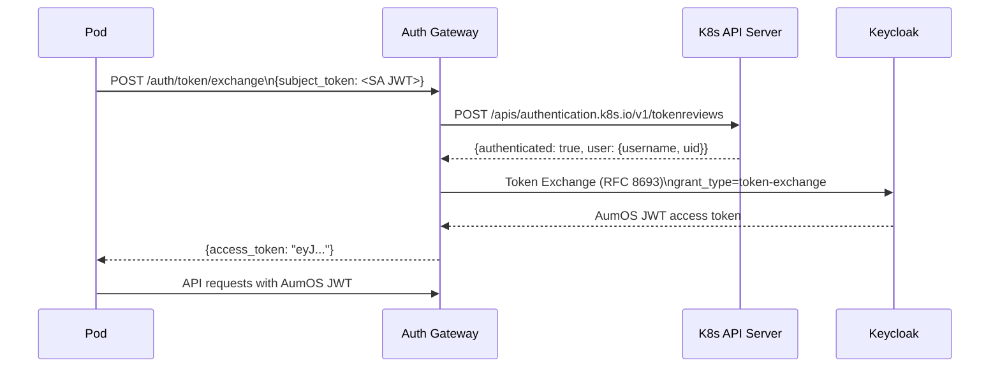

# Kubernetes OIDC Integration

AumOS supports workload identity for pods running in AumOS tenant namespaces. Pods authenticate to the platform using their Kubernetes ServiceAccount token — no long-lived static credentials are stored.

## How it works



## Namespace convention

AumOS tenant namespaces follow the pattern `aumos-tenant-{tenant-name}`. The auth gateway extracts the tenant name from the namespace when validating ServiceAccount tokens.

## Pod configuration

Mount the service account token and configure your pod to request a projected volume with audience:

```yaml
apiVersion: v1
kind: Pod
spec:
  serviceAccountName: my-agent-sa
  volumes:
    - name: aumos-token
      projected:
        sources:
          - serviceAccountToken:
              audience: aumos-platform
              expirationSeconds: 3600
              path: token
  containers:
    - name: agent
      volumeMounts:
        - name: aumos-token
          mountPath: /var/run/secrets/aumos
```

## Token exchange request

```bash
SA_TOKEN=$(cat /var/run/secrets/aumos/token)

curl -X POST https://auth-gateway.aumos.svc/auth/token/exchange \
  -H "Content-Type: application/json" \
  -d "{
    \"subject_token\": \"${SA_TOKEN}\",
    \"subject_token_type\": \"urn:ietf:params:oauth:token-type:jwt\",
    \"audience\": \"aumos-platform\"
  }"
```

## Required environment variables

| Variable | Description |
|----------|-------------|
| `AUMOS_AUTH_K8S_API_URL` | Kubernetes API server URL (e.g., `https://kubernetes.default.svc`) |
| `AUMOS_AUTH_TOKEN_EXCHANGE_CLIENT_ID` | Keycloak client authorized for token exchange |
| `AUMOS_AUTH_TOKEN_EXCHANGE_CLIENT_SECRET` | Client secret for the exchange client |

## Security considerations

- Token exchange requires the K8s ServiceAccount to be in an `aumos-tenant-*` namespace
- The in-cluster SA token used for TokenReview is mounted read-only from the gateway pod's own SA
- OPA fail-closed applies — if K8s API is unreachable, token exchange is denied
- Exchanged tokens carry the tenant context extracted from the K8s namespace
